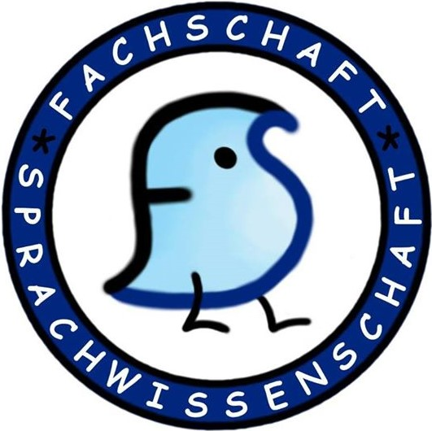

# Date

## Agenda

- Movie Night
- Game Night
- Olympiad

## Meeting
**Present: Thara, Aida, Marie, Idisa, Akshat**

## Movie night
- this Friday ("But I'm a Cheerleader")

## Game Night
- next Nonday
- could suggest people to bring their own games and snacks
- keys needed still for the upstair rooms?
- marie said she can do the game night posters

## Olympiad
- posters haven't printed yet as of 17/06?
- could advertise to highschool for the olympiad
- cognitive science(?) people can also share it (lina said she will send the DM)

## Germany-wide ling-fachschafts meetings
- last meeting too short-noticed (in Berlin also)
- next meeting in Cologne next semester
- we can consider going there next week

## Precourse planning
- Merge with DSA set-up?
- Post the precourse announcement earlier (than last year)
- Put the announcement on website earlier

## Department-specific Buddies
- Could bring this program again
- Ask around how the past events went
- Buddy groups are also a thing

---

Start: 18:40

End: 19:15

Protocol by: Thara & Aida

